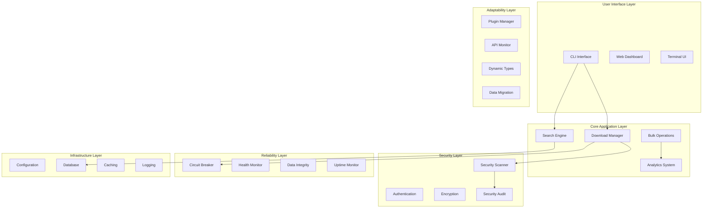
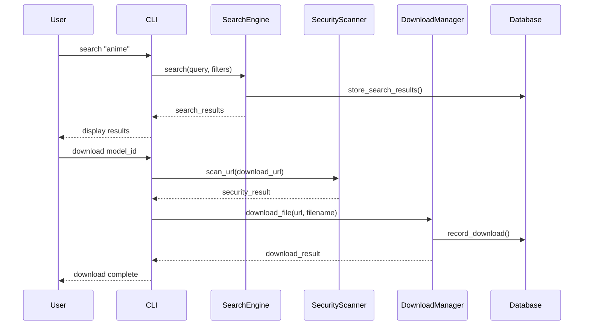
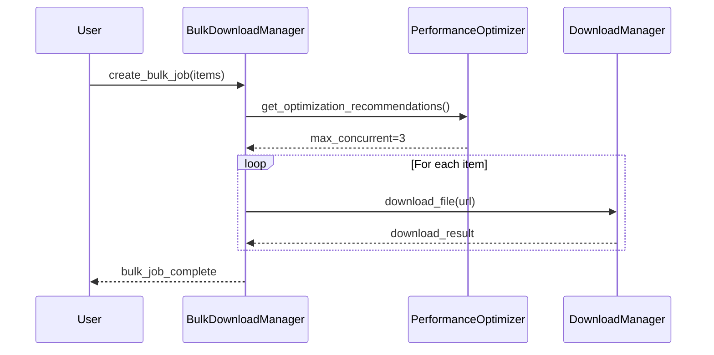

# アーキテクチャ概要ガイド

## 目的

このドキュメントは、CivitAI Downloader v2プロジェクトの最終的なアーキテクチャと各コンポーネントの関係を説明します。新規開発者がプロジェクトを理解し、効率的にメンテナンスや拡張を行えるよう、実装とテストファイルのマッピングを含む包括的な構造を提供します。

> **注記**: このガイドは `tasks.md` で計画された初期設計と最終実装の違いを明確にし、実際のファイル構成を反映しています。

## 全体アーキテクチャ



## ディレクトリ構造と責務

### 📁 `/src` - メインソースコード

#### 🔧 `/src/core` - コアシステム

| サブディレクトリ | 責務 | 主要ファイル | 対応テスト |
|------------------|------|-------------|------------|
| **`/adaptability`** | 将来対応機能 | `api_detector.py`, `plugin_manager.py`, `dynamic_types.py`, `migration.py` | `test_phase6_complete.py` |
| **`/analytics`** | データ分析とレポート | `analyzer.py`, `collector.py`, `reporter.py` | `test_analytics.py`, `test_analytics_comprehensive.py` |
| **`/bulk`** | バルクダウンロード | `download_manager.py` | `test_bulk_download.py` |
| **`/config`** | 設定管理 | `manager.py`, `env_loader.py`, `search_config.py` | `test_authentication.py` (一部) |
| **`/download`** | ダウンロード管理 | `manager.py` | `test_download_manager.py` |
| **`/error`** | エラーハンドリング | `enhanced_error_handler.py` | `test_enhanced_error_handler.py` |
| **`/performance`** | パフォーマンス最適化 | `optimizer.py` | `test_performance_optimizer.py` |
| **`/reliability`** | 信頼性システム | `circuit_breaker.py`, `health_check.py`, `integrity.py`, `uptime_monitor.py` | `test_phase6_complete.py` |
| **`/search`** | 検索エンジン | `advanced_search.py`, `search_engine.py`, `strategy.py` | `test_advanced_search.py`, `test_search_strategy.py` |
| **`/security`** | セキュリティ機能 | `scanner.py`, `encryption.py`, `audit.py`, `access_control.py`, `sandbox.py` | `test_security_scanner.py`, `test_phase5_security.py`, `test_license_manager.py` |

#### 🎨 `/src/ui` - ユーザーインターフェース

| ファイル | 責務 | 対応テスト |
|----------|------|------------|
| **`dashboard.py`** | リアルタイムダッシュボード | `test_phase6_complete.py` |
| **`export.py`** | データエクスポート機能 | `test_phase6_complete.py` |
| **`interactive.py`** | インタラクティブCLI | `test_phase6_complete.py` |
| **`progress.py`** | プログレス表示 | `test_phase6_complete.py` |

#### 🖥️ `/src/cli` - コマンドライン

| ファイル | 責務 | 対応テスト |
|----------|------|------------|
| **`main.py`** | CLIメインエントリーポイント | `test_cli.py` |

#### 📊 `/src/data` - データ管理

| ファイル | 責務 | 対応テスト |
|----------|------|------------|
| **`database.py`** | データベース管理 | 各種テストで使用 |
| **`export/exporter.py`** | データエクスポート | テスト統合 |
| **`history/manager.py`** | 履歴管理 | テスト統合 |

#### 🌐 `/src/api` - API管理

| ファイル | 責務 | 対応テスト |
|----------|------|------------|
| **`client.py`** | CivitAI APIクライアント | 各種テストで使用 |
| **`auth.py`** | API認証 | `test_authentication.py` |
| **`cache.py`** | APIキャッシュ | テスト統合 |
| **`rate_limiter.py`** | レート制限 | テスト統合 |

### 🧪 `/tests` - テストスイート

#### 単体テスト (`/tests/unit`)

| テストファイル | 対象コンポーネント | 主な検証内容 |
|----------------|-------------------|-------------|
| **`test_advanced_search.py`** | `core.search.advanced_search` | 高度検索機能、フィルタリング |
| **`test_analytics.py`** | `core.analytics.*` | 分析データ収集、レポート生成 |
| **`test_authentication.py`** | `api.auth` | API認証、トークン管理 |
| **`test_bulk_download.py`** | `core.bulk.download_manager` | バルクダウンロード、並列処理 |
| **`test_download_manager.py`** | `core.download.manager` | ダウンロード管理、再開機能 |
| **`test_enhanced_error_handler.py`** | `core.error.enhanced_error_handler` | エラーハンドリング、復旧機能 |
| **`test_license_manager.py`** | `core.security.license_manager` | ライセンス検証、コンプライアンス |
| **`test_performance_optimizer.py`** | `core.performance.optimizer` | パフォーマンス最適化、リソース管理 |
| **`test_phase5_security.py`** | `core.security.*` | セキュリティスキャン、暗号化 |
| **`test_search_strategy.py`** | `core.search.strategy` | 検索戦略、N+1問題対応 |
| **`test_security_scanner.py`** | `core.security.scanner` | マルウェア検出、脅威分析 |

#### 統合テスト (`/tests/integration`)

| テストファイル | 対象システム | 主な検証内容 |
|----------------|-------------|-------------|
| **`test_component_integration.py`** | 複数コンポーネント連携 | エンドツーエンドフロー、システム統合 |

#### フェーズテスト (`/tests`)

| テストファイル | 対象フェーズ | 主な検証内容 |
|----------------|-------------|-------------|
| **`test_phase6_complete.py`** | Phase 6 全機能 | エンタープライズ機能統合テスト |

#### CLI テスト (`/tests/cli`)

| テストファイル | 対象 | 主な検証内容 |
|----------------|------|-------------|
| **`test_cli.py`** | CLI全般 | コマンド動作、ユーザー体験 |

## コンポーネント詳細

### 🔍 検索システム

**実装パス**: `src/core/search/`

```python
# メインエントリーポイント
from src.core.search.advanced_search import AdvancedSearchEngine

# 使用例
engine = AdvancedSearchEngine(client=api_client, db_manager=db)
results = await engine.search("anime", filters={"types": ["Checkpoint"]})
```

**主要クラス**:
- `AdvancedSearchEngine`: 高度検索機能
- `SearchStrategy`: 検索戦略管理
- `SearchEngine`: 基本検索機能

**テスト**: `test_advanced_search.py`, `test_search_strategy.py`

### 📥 ダウンロードシステム

**実装パス**: `src/core/download/`, `src/core/bulk/`

```python
# シングルダウンロード
from src.core.download.manager import DownloadManager
manager = DownloadManager(client, download_dir, db_manager)
result = await manager.download_file(url, filename)

# バルクダウンロード
from src.core.bulk.download_manager import BulkDownloadManager
bulk_manager = BulkDownloadManager(download_manager, optimizer, db_manager)
job = await bulk_manager.create_bulk_job("job_name", items)
```

**主要クラス**:
- `DownloadManager`: シングルダウンロード
- `BulkDownloadManager`: バルクダウンロード
- `PerformanceOptimizer`: パフォーマンス最適化

**テスト**: `test_download_manager.py`, `test_bulk_download.py`

### 🛡️ セキュリティシステム

**実装パス**: `src/core/security/`

```python
# セキュリティスキャン
from src.core.security.scanner import SecurityScanner
scanner = SecurityScanner()
result = await scanner.scan_file(file_path)

# 暗号化
from src.core.security.encryption import DataEncryption
encryption = DataEncryption(config)
encrypted = encryption.encrypt_data(data)

# アクセス制御
from src.core.security.access_control import AccessController
access = AccessController(data_dir, policy)
result = access.check_access(session_id, resource, action)
```

**主要クラス**:
- `SecurityScanner`: マルウェア検出、ReDoS保護
- `DataEncryption`: 多段階暗号化
- `AccessController`: RBAC、セッション管理
- `SecurityAuditor`: 監査ログ
- `SecureSandbox`: サンドボックス実行

**テスト**: `test_security_scanner.py`, `test_phase5_security.py`, `test_license_manager.py`

### 🔄 信頼性システム

**実装パス**: `src/core/reliability/`

```python
# サーキットブレーカー
from src.core.reliability.circuit_breaker import CircuitBreaker
breaker = CircuitBreaker("api_calls")
result = await breaker.call(api_function, *args)

# ヘルスチェック
from src.core.reliability.health_check import HealthChecker
checker = HealthChecker()
health = await checker.check_system_health()
```

**主要クラス**:
- `CircuitBreaker`: 障害分離
- `HealthChecker`: システム監視
- `IntegrityManager`: データ整合性
- `UptimeMonitor`: 稼働率追跡

**テスト**: `test_phase6_complete.py` (統合テスト)

### 🔧 拡張性システム

**実装パス**: `src/core/adaptability/`

```python
# プラグイン管理
from src.core.adaptability.plugin_manager import PluginManager
manager = PluginManager(plugin_dir)
await manager.discover_plugins()
result = await manager.execute_hook("process_model", data, context)

# API変更検知
from src.core.adaptability.api_detector import APIChangeDetector
detector = APIChangeDetector(api_client)
changes = await detector.detect_api_changes()
```

**主要クラス**:
- `PluginManager`: プラグイン lifecycle
- `APIChangeDetector`: API変更監視
- `DynamicModelTypeManager`: 動的タイプ管理
- `MigrationManager`: データ移行

**テスト**: `test_phase6_complete.py` (統合テスト)

### 📊 分析システム

**実装パス**: `src/core/analytics/`

```python
# データ収集
from src.core.analytics.collector import AnalyticsCollector
collector = AnalyticsCollector(db_manager)
await collector.record_event("download", "completed", properties)

# レポート生成
from src.core.analytics.reporter import AnalyticsReporter
reporter = AnalyticsReporter(collector)
report = await reporter.generate_usage_report(start_date, end_date)
```

**主要クラス**:
- `AnalyticsCollector`: イベント収集
- `AnalyticsAnalyzer`: データ分析
- `AnalyticsReporter`: レポート生成

**テスト**: `test_analytics.py`, `test_analytics_comprehensive.py`

## 設計パターンと原則

### 1. 依存性注入 (Dependency Injection)

```python
# 各コンポーネントは依存関係を外部から注入
class DownloadManager:
    def __init__(self, client: CivitAIClient, download_dir: Path, 
                 db_manager: DatabaseManager):
        self.client = client
        self.download_dir = download_dir
        self.db_manager = db_manager
```

### 2. 非同期プログラミング

```python
# 全ての I/O 操作は非同期
async def download_file(self, url: str, filename: str) -> DownloadResult:
    async with self.client.session.get(url) as response:
        # 非同期ダウンロード処理
```

### 3. 設定駆動アーキテクチャ

```python
# 設定による動作制御
class SecurityScanner:
    def __init__(self, config: SystemConfig):
        self.max_file_size = config.get('security.max_file_size')
        self.scan_timeout = config.get('security.scan_timeout')
```

### 4. プラグインアーキテクチャ

```python
# 拡張可能なプラグインシステム
class ModelProcessorPlugin(Plugin):
    async def process_model(self, model_data: Dict, context: Dict) -> Dict:
        # カスタム処理ロジック
        return enhanced_model_data
```

## データフロー

### 1. 検索から ダウンロードまで



### 2. バルクダウンロードフロー



## テスト戦略

### 1. 単体テスト (Unit Tests)

- **対象**: 個別クラス・メソッド
- **原則**: 高速、独立、決定的
- **ツール**: pytest, unittest.mock

### 2. 統合テスト (Integration Tests)

- **対象**: コンポーネント間連携
- **原則**: ユーザー視点の振る舞い検証
- **場所**: `tests/integration/test_component_integration.py`

### 3. CLIテスト

- **対象**: エンドユーザー体験
- **原則**: コマンド動作、エラーハンドリング
- **場所**: `tests/cli/test_cli.py`

### 4. フェーズテスト

- **対象**: 特定フェーズの全機能
- **原則**: 機能統合検証
- **場所**: `tests/test_phase6_complete.py`

## 設定管理

### 設定ファイル階層

```
config/
├── app_config.yml          # メイン設定
├── security_policy.yml     # セキュリティポリシー
├── development/            # 開発環境
├── staging/               # ステージング環境
└── production/            # プロダクション環境
```

### 環境変数

```bash
# API設定
CIVITAI_API_BASE_URL=https://civitai.com/api
CIVITAI_API_KEY=your_api_key

# データベース
DATABASE_URL=sqlite:///data/civitai.db

# セキュリティ
SECURITY_SCAN_TIMEOUT=10
SECURITY_MAX_FILE_SIZE=10737418240
```

## デプロイメント

### Docker

```dockerfile
# Multi-stage build
FROM python:3.11-slim as builder
# Build dependencies and virtual environment

FROM python:3.11-slim as production
# Runtime configuration
COPY --from=builder /opt/venv /opt/venv
```

### Kubernetes

```yaml
apiVersion: apps/v1
kind: Deployment
metadata:
  name: civitai-downloader
spec:
  replicas: 1
  template:
    spec:
      containers:
      - name: civitai-downloader
        image: civitai/downloader-v2:latest
```

## パフォーマンス考慮事項

### 1. 非同期処理

- すべてのI/O操作は非同期
- `asyncio` による並行処理
- コネクションプール使用

### 2. キャッシュ戦略

- API応答キャッシュ
- メタデータキャッシュ
- 設定キャッシュ

### 3. リソース制限

- メモリ使用量制限
- 同時ダウンロード数制限
- CPU使用率監視

## セキュリティ考慮事項

### 1. 入力検証

- すべての外部入力を検証
- SQLインジェクション防止
- ReDoS攻撃防止

### 2. アクセス制御

- ロールベースアクセス制御 (RBAC)
- セッション管理
- 監査ログ

### 3. データ保護

- 4段階暗号化レベル
- キー管理
- 整合性チェック

## 将来の拡張性

### 1. プラグイン対応

- 動的プラグインロード
- セキュアサンドボックス
- プラグインAPI

### 2. API適応

- 自動API変更検出
- スキーマ適応
- フォールバック機能

### 3. スケーラビリティ

- 水平スケーリング対応
- 分散処理
- クラウドネイティブ

## トラブルシューティング

### 一般的な問題

| 問題 | 原因 | 対処法 | 関連ファイル |
|------|------|--------|-------------|
| インポートエラー | パス設定 | `PYTHONPATH` 確認 | `src/__init__.py` |
| 設定エラー | 設定ファイル | `config/app_config.yml` 確認 | `src/core/config/manager.py` |
| DB接続エラー | データベース | 権限・パス確認 | `src/data/database.py` |
| ダウンロード失敗 | ネットワーク | プロキシ・DNS確認 | `src/core/download/manager.py` |

### ログ分析

```bash
# エラーログ確認
grep ERROR logs/civitai-downloader.log

# パフォーマンス分析
grep "slow_query\|timeout" logs/civitai-downloader.log

# セキュリティ監査
grep "security\|threat" logs/audit.log
```

## 開発ガイドライン

### 1. コード品質

- 型ヒント必須
- docstring 必須
- テストカバレッジ 80%+

### 2. コミット規則

```
feat: 新機能追加
fix: バグ修正
docs: ドキュメント更新
test: テスト追加・修正
refactor: リファクタリング
```

### 3. ブランチ戦略

- `main`: 安定版
- `develop`: 開発版
- `feature/*`: 機能ブランチ
- `hotfix/*`: 緊急修正

## まとめ

このアーキテクチャガイドにより、開発者は以下を効率的に行えます：

1. **新機能開発**: 適切なコンポーネントと場所の特定
2. **バグ修正**: 責任範囲の明確化
3. **テスト作成**: 対応するテストファイルの特定
4. **設定変更**: 設定項目と影響範囲の理解
5. **デプロイメント**: 環境別の設定と手順

プロジェクトの継続的な成長と品質維持のため、このガイドは定期的に更新し、実装との整合性を保つことが重要です。